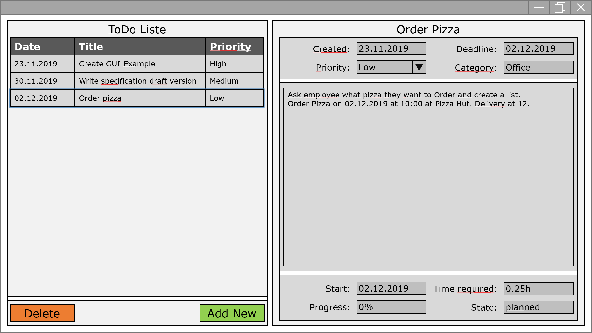

# To-Do-List & -Planner
### Next Steps:
- [ ] Create wireframe

- [ ] Write some requirements

  

### ToDo-Liste&Planungs-Tool

  

#### Parameter ToDos:

| Parameter | Typ | Beschreibung | Fragen | Mandatory |
|--|--|--|--|--|
| Name | String | Titel der Aufgabe | Zeichenanzahl limitieren (maxlength von DB bestimmt) | X |
| Beschreibung | String | Detaillierte Beschreibung zur Aufgabe | Zeichenanzahl limitieren? (maxlength von DB bestimmt) |  |
| Priorität | enum | 0 = None, 1 = Niedrige Priorität, 5 = Höchste Prio | Was für Prios soll es alles geben? Gemäss Bemerkung okay? | X |
| Abschlusstermin/Deadline | datetime | Datum an welchem die Aufgabe fertig sein muss/soll | Datentyp muss noch definiert werden |  |
| Startdatum | datetime | Zeitpunkt an dem mit der Aufgabe begonnen werden soll |  |  |
| Kategorie | String | Kategorie der Aufgabe | Auswahl selber erstellt (mit Möglichkeit für neue Kategorien) |  |
| Status | enum | Auswahl: 0 = None, 1 = offen, 2 = geplant, 3 = in Arbeit, 4 = erledigt | Wie viele verschiedene Status gibt es? Enum einfach Erweiterbar. Status wählbar oder automatisch über andere Parameter ermittelbar? | X |
| Erstellungsdatum | datetime | Datum und Uhrzeit bei Erstellung |  | X |
| Änderungsdatum | datetime | Datum bei Änderung | Eventuell mit Information was geändert wurde (Änderungshistorie) |  |
| Zeitaufwand | int | Zeit in Stunden |  |  |
| Fortschritt | int | 0-100% | Funktionalität von Status schon abgedeckt? |  |

#### Views:
- ToDo-Liste
- ToDo-Erstellung/-Bearbeitung --> Formular

### Packages:
- MaterialDesignThemes
- MaterialDesignColors
- ShowMeTheXAML
  
#### Erweiterungen:

- Planungstool --> Kalender --> https://docs.microsoft.com/en-us/dotnet/api/system.globalization.calendar?view=netframework-4.8

- Datenbank auf einem Webserver

- Export zu PDF, Druckversion

- Benachrichtigung 1 Woche vor Ende der Deadline

#### GUI

